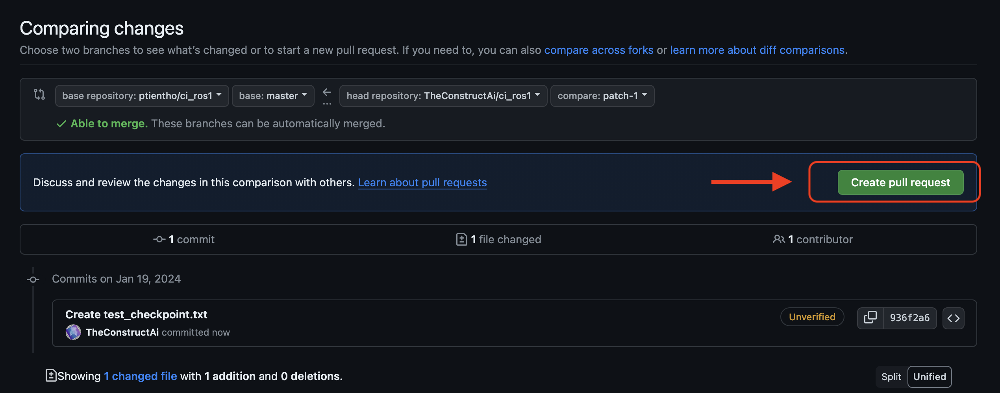

# tortoisebot ros1 ci

## Test docker part manually
run **docker compose**
```
cd catkin_ws/src/ros1_ci/
docker-compose -f docker-compose-sim1.yml up --build
```
if you want to execute another thing
```
sudo docker exec -it waypoints_container /bin/bash
```

## Run automation automatically
Please create a Pull Request


## Commands for running Jenkins manually
for checking the available jenkins commands 
```
java -jar jenkins-cli.jar -s http://localhost:8080/$SLOT_PREFIX/jenkins/ -auth @.jenkins_cli help
```
for **running** and checking the log, use jenkins CLI
```
java -jar jenkins-cli.jar -s http://localhost:8080/$SLOT_PREFIX/jenkins/ -auth @.jenkins_cli build ros1_auto -f -s -v
```
for **aborting** the jenkins work
```
java -jar jenkins-cli.jar -s http://localhost:8080/$SLOT_PREFIX/jenkins/ -auth @.jenkins_cli stop-builds ros1_auto
```
for maintaining clean the works history
```
java -jar jenkins-cli.jar -s http://localhost:8080/$SLOT_PREFIX/jenkins/ -auth @.jenkins_cli delete-builds ros1_auto <buildNumber>
```

asdasd